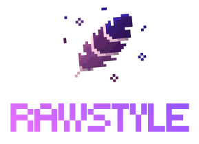

<div align="center">
	
	<br>
	A lightweight compile-time <b>CSS-in-JS library</b> for React apps
	<br><br>
	<p>
		<a href="https://www.npmjs.com/package/rawstyle"></a>&nbsp;
		<a href="https://www.npmjs.com/package/rawstyle"></a>&nbsp;
		<a href="https://github.com/rawstylecss/rawstyle/blob/master/LICENSE"></a>&nbsp;
		<a href="https://github.com/rawstylecss/rawstyle/issues?q=is%3Aissue+is%3Aopen+label%3Abug"></a>
	</p>
	<p><b>
		<a href="#-features">Features</a>&nbsp; •&nbsp;
		<a href="#-quick-start">Quick Start</a>&nbsp; •&nbsp;
		<a href="#%EF%B8%8F-setup">Setup</a>&nbsp; •&nbsp;
		<a href="#%EF%B8%8F-usage">Usage</a>&nbsp; •&nbsp;
		<a href="#-api">API</a>&nbsp; •&nbsp;
		<a href="#-ecosystem">Ecosystem</a>
	</b></p>
	
</div>

## 🔥 Features

- **⚡ True Zero Runtime:** styles are extracted at compile-time, no JS in production
- **💎 Native CSS:** write regular CSS with all modern features
- **📦 Modern Bundlers:** built-in support for Next.js (Turbopack) and Vite (Rolldown)
- **🔥 Hot Reload:** instant CSS updates during development
- **🌐 Global Types:** eliminate the need to import `css` in every module
- **🧩 [VS Code Extension](https://github.com/rawstylecss/rawstyle-vscode):** syntax highlighting, validation, autocompletion, tooltips, and more
- **🧹 [ESLint Plugin](https://github.com/rawstylecss/rawstyle-eslint):** auto-fixable formatting rules for CSS inside templates

## 🚀 Quick Start

No need to read further, just try it out:

```bash
pnpm create rawstyle  # scaffold a demo project for your chosen platform
```

## ⚙️ Setup

1. Install the сore and the appropriate bundler plugin:

```bash
pnpm add -D rawstyle @rawstyle/next  # for Next.js
pnpm add -D rawstyle @rawstyle/vite  # for Vite
```
2. Configure the bundler to use the plugin:

### Next.js (Turbopack)

```ts
// next.config.ts
import { rawstyleTurboRule } from '@rawstyle/next'
import type { NextConfig } from 'next'

export default {
	turbopack: { rules: { ...rawstyleTurboRule } },
} satisfies NextConfig
```
> The loader extracts CSS and injects it into the module as a base64-encoded CSS import.

### Vite (Rolldown)

```ts
// vite.config.ts
import react from '@vitejs/plugin-react'
import rawstyle from '@rawstyle/vite'
import type { UserConfig } from 'rolldown-vite'

export default {
	plugins: [react(), rawstyle()],
} satisfies UserConfig
```
> The plugin emits a virtual `.css` module containing extracted styles and imports it as a side effect.

## 🕹️ Usage

### Import-based

```tsx
import { css, gcss, cn } from 'rawstyle'
```
### Global types (recommended)

You can make the `css`, `gcss`, and `cn` type declarations global to avoid importing them in every module:

```jsonc
// via tsconfig.json:
"compilerOptions": {
	"types": ["rawstyle/globals"]
}
```
```ts
// or add this to your global.d.ts:
import 'rawstyle/globals'
// or
/// <reference types="rawstyle/globals" />
```

## 🧩 API

Rawstyle provides three core primitives: `css`, `gcss`, and `cn`:

```tsx
// src/module.tsx
export const Component = ({ theme }: { theme: string }) => (
	// cn - class names merging utility
	<div className={cn('common', theme === 'dark' && card)}>
		Hello, World!
	</div>
)
// css - define scoped CSS
const card = css`
	padding: 1rem;
	color: var(--primary);
	&:hover { box-shadow: 0 4px 12px black; }
`
// gcss - define global CSS
void gcss`
	:root { --primary: #303030; }
	body { margin: 0; background: #ebebeb; }
`
```

This code compiles to:

```tsx
import '\0virtual.css'

export const Component = ({ theme }: { theme: string }) => (
	<div className={['common', theme === 'dark' && 'card_hash5'].filter(Boolean).join(' ')}>
		Hello, World!
	</div>
)
```

As you can see, the `card` variable is replaced with a hashed class name, `cn` is transformed into a conditional string joiner, and the CSS is extracted into a separate virtual `.css` file:

```css
/* virtual.css */
:root { --primary: #303030; }
body { margin: 0; background: #ebebeb; }

.card_hash5 {
	padding: 1rem;
	color: var(--primary);
	&:hover { box-shadow: 0 4px 12px black; }
}
```

## 🧩 Ecosystem

[**Rawstyle**](https://github.com/rawstylecss) provides a suite of tools to enhance your development experience:
- [VS Code Extension 🡥](https://github.com/rawstylecss/rawstyle-vscode)
- [ESLint Plugin 🡥](https://github.com/rawstylecss/rawstyle-eslint)

<br>

<div align="center">
	<b>MIT License © 2026 <a href="https://github.com/rawstylecss">Rawstyle</a></b>
</div>